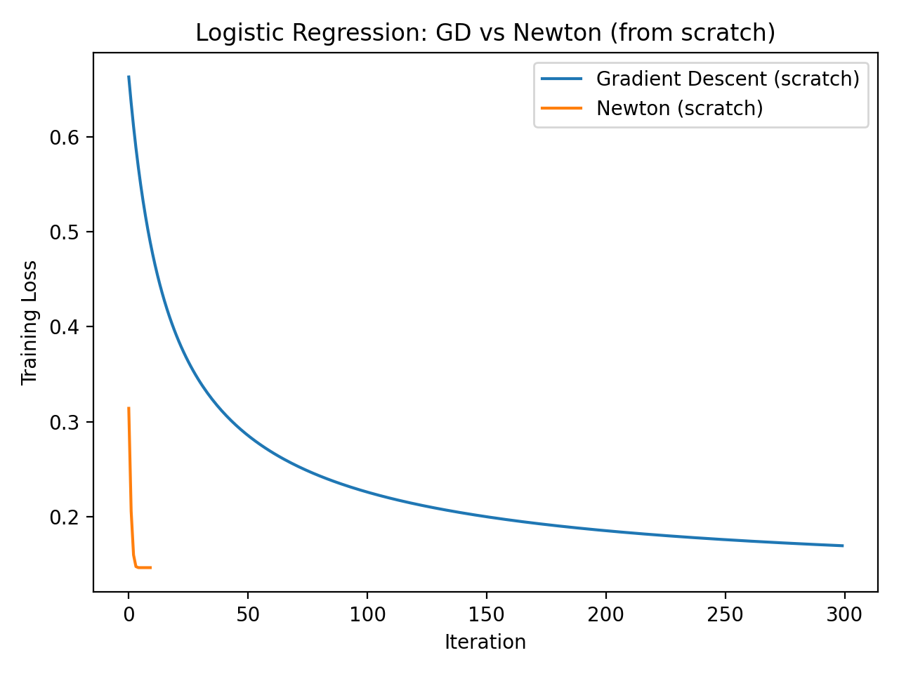

# ScratchML (PyTorch, CPU-only): Logistic Regression from Scratch — GD vs Newton

## Goal
Implement binary logistic regression from scratch using PyTorch tensors and **manual optimization**, then empirically compare convergence behavior between **Gradient Descent** and **Newton (IRLS-style)**. Validate correctness against a standard PyTorch baseline.

## Model
Given features $x \in \mathbb{R}^d$, define the logit
$$z = w^\top x + b$$
and probability
$$p(y=1 \mid x) = \sigma(z) = \frac{1}{1 + e^{-z}}.$$

## Objective (stable form from logits)
For labels $y \in \{0,1\}$, the regularized negative log-likelihood is
$$\mathcal{L}(w,b) = \frac{1}{n}\sum_{i=1}^n \Big(\log(1+e^{z_i}) - y_i z_i\Big) + \lambda \lVert w \rVert_2^2.$$
To avoid overflow, $\log(1+e^{z})$ is computed using the numerically stable function $\mathrm{softplus}(z)$.

## Optimization

### Full-batch Gradient Descent
Let $X \in \mathbb{R}^{n \times d}$ be the design matrix and $z = Xw + b\mathbf{1}$. The gradients are
$$\nabla_w = \frac{1}{n}X^\top(\sigma(z)-y) + 2\lambda w,
\qquad
\nabla_b = \frac{1}{n}\sum_{i=1}^n(\sigma(z_i)-y_i).$$
Parameters are updated using a fixed learning rate $\eta$:
$$w \leftarrow w - \eta \nabla_w,
\qquad
b \leftarrow b - \eta \nabla_b.$$

### Newton / IRLS-style second-order method
Define the diagonal matrix
$$R = \mathrm{diag}\big(\sigma(z)\odot(1-\sigma(z))\big).$$
The Hessian is
$$H = \frac{1}{n}X^\top R X + 2\lambda I.$$
A small damping term $\delta I$ is added for numerical stability:
$$H \leftarrow H + \delta I.$$
The Newton step solves
$$H \Delta = \nabla_w$$
and updates
$$w \leftarrow w - \Delta.$$
(An analogous scalar update can be applied to $b$ using the mean curvature of $R$.)

## Experiment setup (CPU-only)
- Dataset: synthetic binary classification
- Preprocessing: standardization (mean $0$, std $1$)
- Metrics: validation accuracy; training loss curves
- Reproducibility: fixed seed

## Results
A one-command benchmark produces `results/benchmark.json` and `results/summary.md`.

| Method | Iters | Final Loss | Val Acc | Train (s) |
|---|---:|---:|---:|---:|
| Scratch GD | 300 | 0.169470 | 0.9625 | 0.087 |
| Scratch Newton | 10 | 0.146404 | 0.9575 | 0.007 |
| PyTorch baseline (LBFGS) | — | — | 0.9550 | 0.032 |



## Takeaways
- Newton reaches a low training loss in $\approx 10$ iterations, while GD requires hundreds for similar performance.
- The from-scratch implementation matches a standard PyTorch baseline closely in validation accuracy.

## How to reproduce
```bash
python -m scripts.benchmark_all
